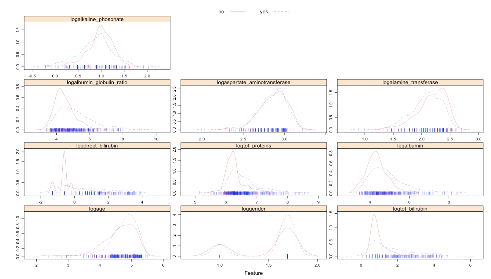
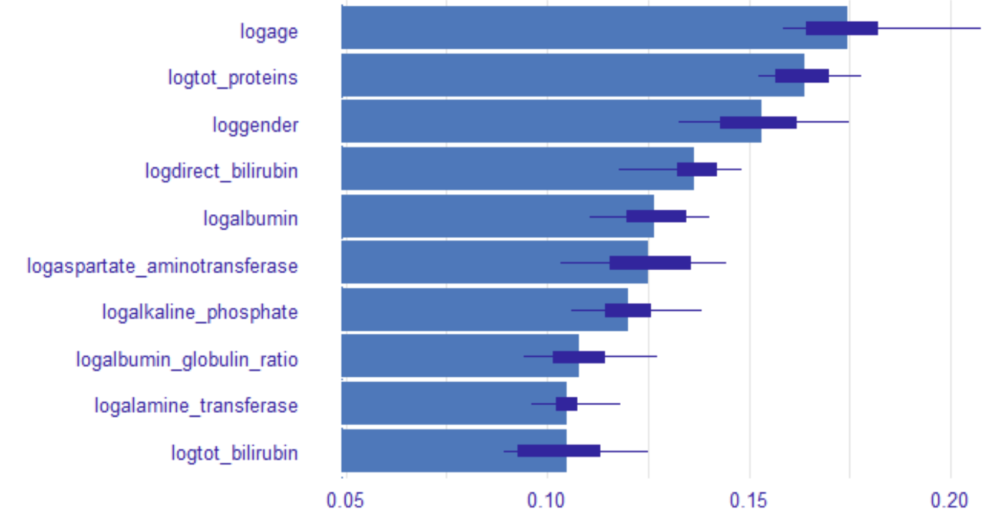

# Liver Disease Predictor: Project Overview 

* **Objective**  
This project aims to build an optimal classification machine learning model to accurately predict whether patients will develop liver-associated disease. Being one of the most common causes of death worldwide, liver disease is responsible for nearly 2 million deaths per year, and the number is growing every year. Thus, being able to accurately predict whether someone might have liver disease is not only beneficial but crucial, especially for ones who have comorbidities. 

* **Walkthrough** 
    - Define the question and collect the data
    - Exploratory Data Analysis
    - Data Cleaning 
    - Fit Machine Learning Models & Hyperparameter Tuning & Compare their performances 

* **Data & Coding Language Used** 
    - Data: Collected from patient records in North East of Andhra Pradesh, India 
    - R Version: 4.0.3
    - Packages: tidyverse, caret, glmnet, mlbench, pdp, vip, rpart, ranger, kernlab, gbm, pROC, janitor, corrplot, readxl

### Exploratory Data Analysis 
* The stratified distribution of each feature was checked. 
  Log transformation was done on the skewed features, which made their distributions more normal. 
  &#8594; It could be seen that each feature's distribution per outcome class is similar. 
   

### Data Cleaning  
* Data were scaled 
* Skewed features underwent log transformation 
* Cleaned feature names for easier identification 
* Re-coded the binary classes of the outcome variable as ‘yes’ and ‘no’ 
* Dropped the very few missing values that were present in the dataset 
* Data had balanced outcome classes 

### Fit Machine Learning Models & Compare their Performances 
* The data were split into train and test sets with a test size of 20%
* Ten models (Regularized logistic regression, MARS, LDA, QDA, Naive Bayes, KNN, Decision Tree, Random Forest, ADA Boosting, SVM) were trained 
  and the hyperparameters were tuned 
* Each model's accuracy and sensitivity were compared: Naive Bayes was chosen as the final model because its accuracy and sensitivity were the highest
* The accuracy of the final model was checked with test data 
* The feature importance plot was created
 

